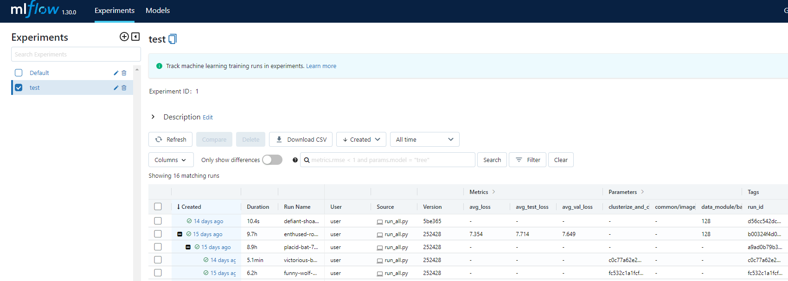
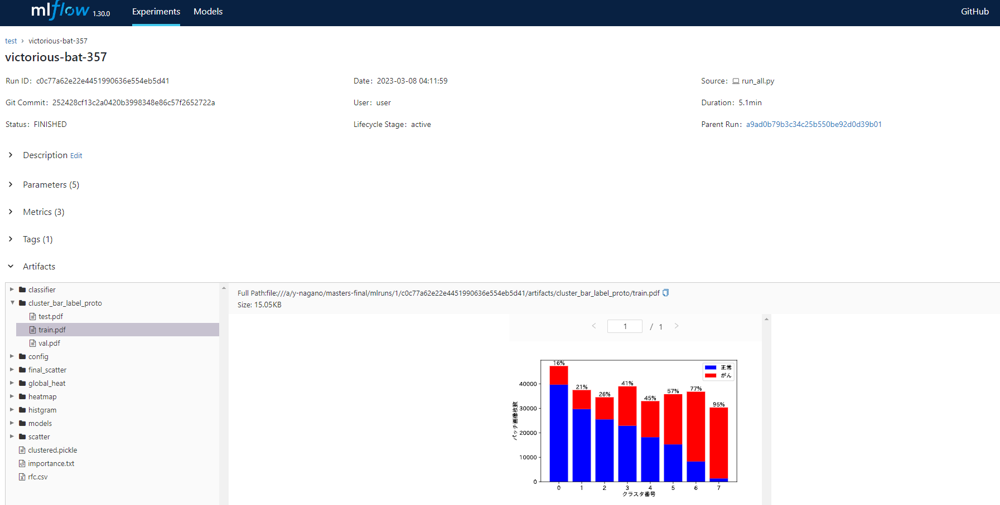

# 概要
修士論文で制作した自己教師あり学習(DINO)とkMeans,RFを組み合わせた画像分類器です．
高解像度な画像を分割し自己教師を適用することで，計算資源上の問題をクリアし，また，判断要因となる画像領域の考察を行うことができます．

mlflowで実験データを管理しています．
これにより，簡単に訓練済みモデルやデータを再利用することができます．

# 環境構築と実行方法
1. データの配置
    - `git clone このリポジトリ`
    - 画像データを`./dataset/`以下に配置
2. Docker build

    `make docker-build`

3. Docker run

    `make docker-run`

---以下コンテナの中---

4. mlflowのUIサーバー立ち上げ

    `nohup mlflow ui --port 5000 -h 0.0.0.0 & `

5. 訓練実行

    `python run_all.py`

6. 実験結果確認

    [localhost:5000](http://localhost:5000)

## パラメータ設定
実験環境は`./config以下`のコンフィグファイルで管理しています．
直接書き換えるか，実行時に以下のように指定することでカスタマイズできます．
`python run_all.py extract_features.model.lr=0.05`

# mlflowについて

mlflowはかなり多機能な機械学習管理のプラットフォームです．
本プロジェクトではそのごく一部のみ（Mlflow Tracking）を実験データ管理利用しています．

mlflowはexperiment（フォルダ）の中にrun（ファイル）を追加していくことで実験を管理します．
runは実験パラメータ(Parameters)，結果や評価指標など(Metrics)に加えて，Artifactと呼ばれるデータを保存できます．
Parameters, Metricsには数値や文字列データのみしか記録できませんが，Artifactにはどのようなデータでも保存できます．
これらのデータは`./mlruns/{experiment_id}/`以下に **普通の形式** で保存されており，簡単に確認や利用を行うことができます．（Mlflow UIはこれらのデータのビューワーになります）

# データの再利用
runは固有のrun_idを持ちます．特に指定せずにrun_all.pyを実行した場合はランダムにrun_idが割り当てられます．
実行済みのrun_idを指定すると，そのrunで保存されたデータを再利用するようになっています．（これはmlflowの機能ではなく，独自に実装したものです．）
なお，本プロジェクトでは実験全体を3つのrunの入れ子で構成しています．
そのため，「1段目の結果のみ再利用」「1，2段目のみ再利用」といった運用が可能です．
**なお，run_idを指定した場合，そのrunに関する実行時設定はすべて無視され，指定したrunの保存されていた設定が再度読み込まれて適用されます．**
**また，2段目のみ再利用等の実行結果は想定していません．エラーも出ません．**

- extract_features: 自己教師の画像特徴抽出機(DINO)の訓練と特徴抽出
    - reduce_dimension: 抽出した特徴量の次元圧縮
        - clusterize_and_classify: 次元圧縮データのクラスタリングとヒストグラム生成による分類

`python run_all.py extract_features_id=c0c77a62e22e4451990636e554eb5d41 reduce_dimension_id=fc532c1a1fcf46a184fe22e8e497f2d5`

